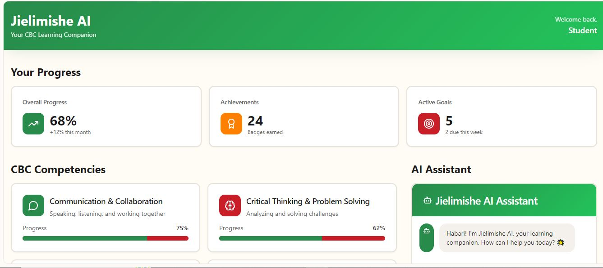
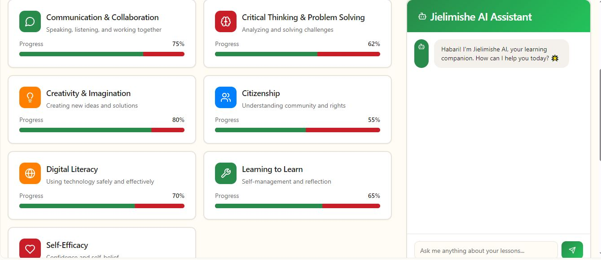
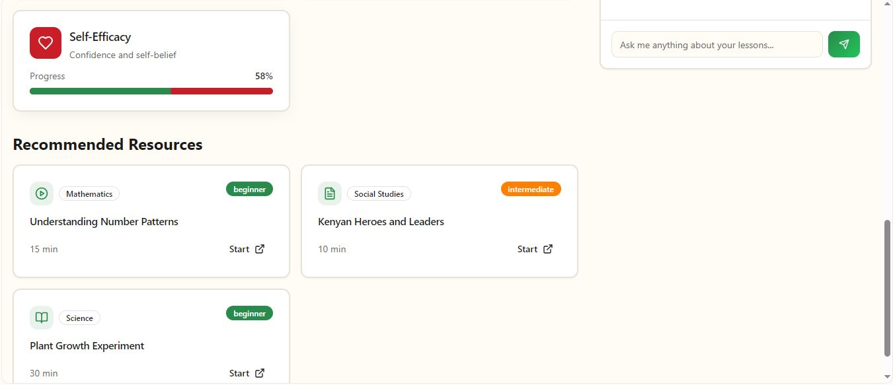

# Welcome to your Jielimishe-AI project

## Project info

Jielimishe AI is an AI-powered learning companion designed specifically for Kenya's Competency-Based Curriculum (CBC), helping students master the seven core competencies through personalized learning paths and real-time progress tracking. The platform features an intelligent AI assistant that provides instant support, adaptive assessments that identify individual strengths and weaknesses, and curated learning resources tailored to each student's unique needs. By combining beautiful, gamified interfaces with practical tools for students, teachers, and parents, Jielimishe AI makes CBC learning more engaging, manageable, and effective for all stakeholders in the education ecosystem.

## How can I edit this code?

**Use your preferred IDE**

If you want to work locally using your own IDE, you can clone this repo and push changes. Pushed changes will also be reflected in Lovable.

The only requirement is having Node.js & npm installed - [install with nvm](https://github.com/nvm-sh/nvm#installing-and-updating)

Follow these steps:

```sh
# Step 1: Clone the repository using the project's Git URL.
git clone <YOUR_GIT_URL>

# Step 2: Navigate to the project directory.
cd <YOUR_PROJECT_NAME>

# Step 3: Install the necessary dependencies.
npm i

# Step 4: Start the development server with auto-reloading and an instant preview.
npm run dev
```

**Edit a file directly in GitHub**

- Navigate to the desired file(s).
- Click the "Edit" button (pencil icon) at the top right of the file view.
- Make your changes and commit the changes.

**Use GitHub Codespaces**

- Navigate to the main page of your repository.
- Click on the "Code" button (green button) near the top right.
- Select the "Codespaces" tab.
- Click on "New codespace" to launch a new Codespace environment.
- Edit files directly within the Codespace and commit and push your changes once you're done.

## What technologies are used for this project?

This project is built with:

- Vite
- TypeScript
- React
- shadcn-ui
- Tailwind CSS





- 
